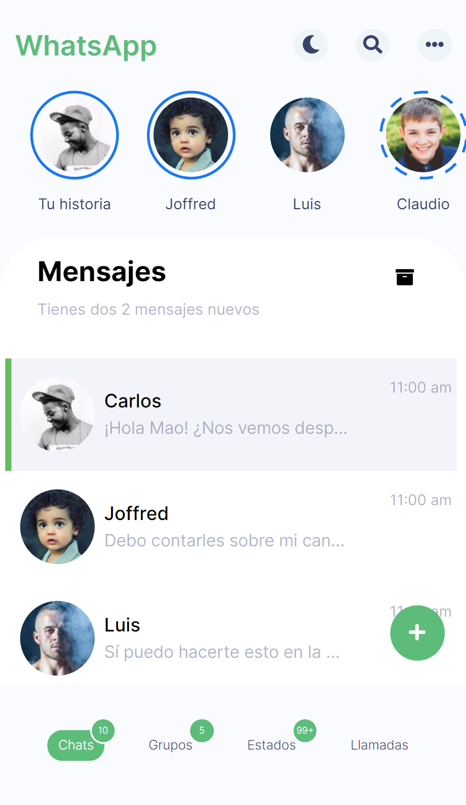
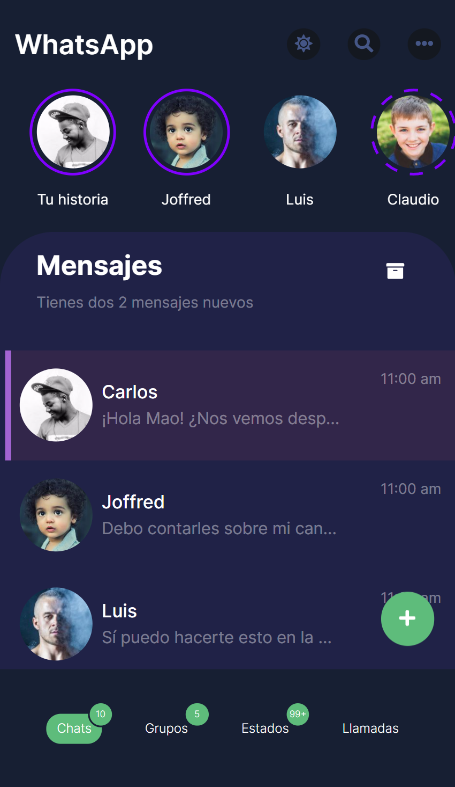
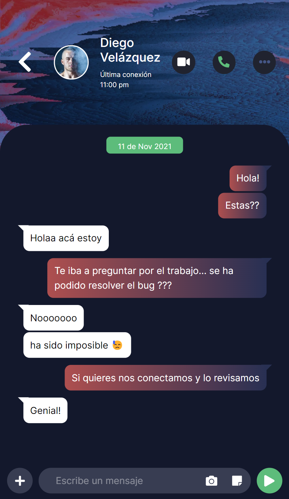

<h1 align="center">Whatsapp Redesign Vue-Sockets.io</h1>
<p>
  
</p>

> Whatsapp redesign using Sockets.io, Vue & E2E encryption. Based on a design made by Mao Lop. 

> Status: WIP, details at the bottom

<div align="center">
  
  
  
</div>

# Frontend
## Build 

```sh
yarn build
```

## Development 

```sh
yarn serve
```

# Backend
## Run dev server

```sh
yarn start
```


## WIP

### Frontend
<ul>
<li> ✅ Dark Mode </li>
<li> ✅ Chats view </li> 
<li> ✅ Chat Conversation view </li> 
<li> ✅ Groups view </li> 
<li> ✅ Vuex setup </li> 
<li> ✅ PWA </li> 
<li> ❌ Link Vuex state with Sockets.io API </li> 
<li> ❌ Groups Conversation view </li> 
<li> ❌ Estados view </li> 
<li> ❌ Llamadas view </li> 
<li> ❌ Local data persitence (Inedexed DB) </li> 
</ul>

### Backend
<ul>
<li> ✅ Basic API functionality </li>
<li> ✅ Configure nonce for CSP implementation </li> 
<li> ✅ Secutity setup </li> 
<li> ❌ JWT auth implementation </li> 
<li> ❌ Sockets.io final events </li> 
<li> ❌ E2E encryption </li> 
<li> ❌ Dockerize </li> 
</ul>


## Authors

### Development
👤 **Ignacio Riveros**
* Github: [@irevors](https://github.com/irevors)
* 
### Design
👤 **Mao Lop**
https://dribbble.com/shots/15990476-Whatsapp-Redesign-Concept


***
